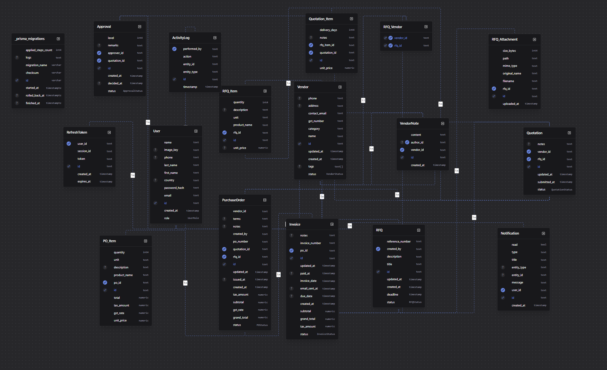

# VendorBridge

VendorBridge is a comprehensive role-based B2B Vendor Management and Procurement System designed to streamline the procurement lifecycle from raising RFQs (Request for Quotations) to settling Invoices. 

## 🚀 Tech Stack
- **Frontend**: Next.js 14, React, Tailwind CSS, Framer Motion, React Query, Axios, Shadcn UI
- **Backend**: Node.js, Express, TypeScript, Zod
- **Database**: PostgreSQL with Prisma ORM
- **Storage & CDN**: Cloudflare R2 for secure, lightning-fast uploaded file storage and global CDN optimization
- **Authentication**: Secure JWT-based Authentication using HTTP-only cookies with rotating Access & Refresh tokens, plus full Forgot/Reset Password flows

## 👥 Role-Based Access Control (RBAC)
The platform offers 4 primary roles:
1. **Admin**: Full access to the system, manages all users and vendor directories.
2. **Manager**: Reviews and approves high-value quotations, analyzes reports.
3. **Procurement Officer**: Creates RFQs, invites vendors, reviews incoming quotations, generates POs.
4. **Vendor**: Submits quotations for RFQs, tracks order status, submits invoices.

## 🗄️ Database Schema


## 📁 Project Structure
- `/frontend`: Next.js web application.
- `/backend`: Express.js backend API and Prisma database schemas.

## ✨ Key Features & Enhancements

### ☁️ Cloudflare R2 Integration & CDN Optimization
VendorBridge leverages **Cloudflare R2** for all file storage (RFQ attachments, vendor documents, and profile pictures). This provides:
- **Zero Egress Fees**: Cost-effective storage scaling for heavy procurement documents.
- **Global CDN**: Uploaded assets are served via Cloudflare's edge network, ensuring lightning-fast load times for vendors and officers globally.
- **Secure Access**: Private buckets with signed URLs for sensitive procurement documents.

### 🔐 Advanced Authentication
The authentication system is built for enterprise-grade security:
- **Dual-Token Architecture**: Uses short-lived Access Tokens and long-lived Refresh Tokens.
- **HTTP-Only Cookies**: Tokens are securely stored in HTTP-only, SameSite cookies to prevent XSS and CSRF attacks.
- **Seamless Refresh**: The frontend Axios interceptor automatically catches 401 Unauthorized errors and silently refreshes the access token in the background without interrupting the user experience.
- **Account Recovery**: Complete Forgot & Reset Password workflow using secure, time-boxed reset tokens.

## 🌐 Application Architecture & Flows
1. **Vendor Registration**: Admins or Procurement Officers register Vendors. Vendors can also be invited to register.
2. **RFQ Generation**: Procurement Officers create RFQs with required items, deadlines, and terms.
3. **Quotation Submission**: Vendors view RFQs and submit itemized quotations.
4. **Quotation Comparison**: The system automatically generates a comparison matrix to find the lowest bidder.
5. **Approval Workflow**: Multi-level approvals based on total value. 
6. **Purchase Order (PO)**: Automatically or manually generated POs upon quotation approval.
7. **Invoice Management**: Invoices generated from POs. Features include PDF generation and email delivery.

---

## 📡 API Endpoints

### Authentication (`/api/auth`)
- `POST /register`: Register a new user.
- `POST /login`: Login and receive access/refresh tokens.
- `GET /me`: Get current authenticated user profile.
- `POST /revoke-token`: Logout by clearing cookies.

### Vendors (`/api/vendors`)
- `GET /`: List vendors (with pagination, filters).
- `POST /`: Create a new vendor.
- `GET /:id`: Get specific vendor details.
- `PATCH /:id`: Update vendor.
- `DELETE /:id`: Delete vendor.

### RFQs (`/api/rfqs`)
- `GET /`: List all RFQs.
- `POST /`: Create a new RFQ.
- `GET /:id`: Get RFQ details and required items.
- `PATCH /:id/status`: Update RFQ status (e.g. DRAFT, SENT, CLOSED).
- `DELETE /:id`: Delete an RFQ.

### Quotations & Comparison (`/api/quotations` & `/api/comparison`)
- `GET /api/quotations`: List quotations.
- `POST /api/quotations`: Submit a quotation for an RFQ.
- `GET /api/quotations/:id`: Get quotation details.
- `GET /api/comparison/:rfqId/compare`: Get a comparison matrix for all quotations under a specific RFQ.
- `POST /api/comparison/:rfqId/select`: Select a winning quotation and initiate approval.

### Approvals (`/api/approvals`)
- `GET /`: List pending approvals.
- `POST /`: Create a manual approval request.
- `GET /:id`: View an approval request.
- `PATCH /:id/approve`: Approve a quotation.
- `PATCH /:id/reject`: Reject a quotation.
- `POST /:id/escalate`: Escalate the approval to the next level.
- `GET /quotation/:quotationId`: Get the full approval timeline for a specific quotation.

### Purchase Orders (`/api/pos`)
- `GET /`: List POs.
- `POST /`: Create a PO manually.
- `GET /:id`: Get PO details.
- `PATCH /:id/status`: Update PO status (e.g. PENDING, SENT, ACCEPTED, REJECTED).
- `POST /:id/invoices`: Generate an invoice from a PO.

### Invoices (`/api/invoices`)
- `GET /`: List invoices.
- `GET /:id`: Get invoice details.
- `PATCH /:id/status`: Update invoice status (e.g. PAID, UNPAID).
- `GET /:id/pdf`: Download invoice as PDF.
- `POST /:id/send`: Send invoice via email.

---

## 🖥️ Frontend Pages & Routes

- `/`: Landing page
- `/login`: User login
- `/signup`: User registration
- `/dashboard`: High-level metrics overview
- `/dashboard/vendors`: Vendor directory and management
- `/dashboard/rfqs`: RFQ list and creation flow (`/dashboard/rfqs/new`)
- `/dashboard/quotations`: Submission form for Vendors, quotation list for Officers
- `/dashboard/quotations/compare`: Automated comparison matrix for Procurement Officers
- `/dashboard/approvals`: Approval queue for Managers and Admins
- `/dashboard/purchase-orders`: Manage generated POs
- `/dashboard/invoices`: Track and pay vendor invoices

## 🛠️ How to Run Locally

### 1. Database Setup
Ensure PostgreSQL is running locally or provide a cloud connection string.
```bash
cd backend
# Create .env file with DATABASE_URL
npx prisma generate
npx prisma db push
npx prisma db seed # Seeds initial data
```

### 2. Start the Backend Server
```bash
cd backend
npm install
npm run dev
# Runs on http://localhost:5000
```

### 3. Start the Frontend App
```bash
cd frontend
npm install
npm run dev
# Runs on http://localhost:3000
```
